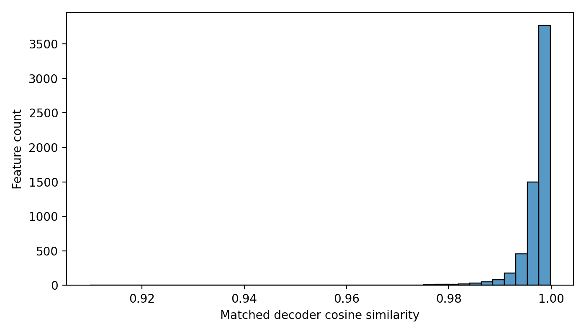
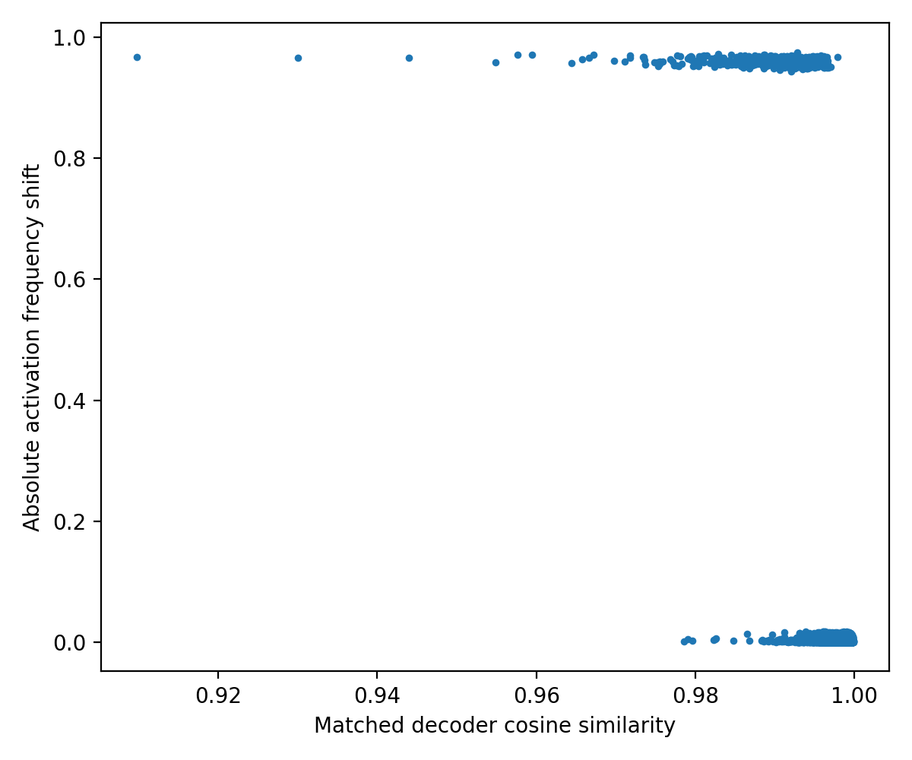

# Do Sparse Autoencoder Features Drift After Narrow-Domain Fine-Tuning?

## A Mechanistic Interpretability Study Using Pythia-160M and Sparse Autoencoders

**Author:** Kumar Mohit  
**Program:** AIMS DTU Research Internship 2026 – Mechanistic Interpretability Track

---

# Abstract

Understanding how language models internally represent information remains one of the central challenges of mechanistic interpretability. While fine-tuning is widely used to specialize pretrained language models for downstream tasks, relatively little is known about how such specialization affects the model's internal feature representations.

This project investigates representational drift induced by narrow-domain fine-tuning using Sparse Autoencoders (SAEs). An SAE was trained on activations extracted from the middle MLP layer of Pythia-160M. The base model was subsequently fine-tuned on Python source code, and a second SAE was trained on activations from the same layer of the fine-tuned model. Decoder vectors were aligned using Hungarian matching and compared using cosine similarity and activation-frequency statistics.

Across 6144 matched features, 5668 (92.25%) remained stable while 476 (7.75%) exhibited significant activation-frequency shifts. No reoriented features were observed, and decoder vectors remained highly aligned with a mean cosine similarity of 0.9973. These results suggest that domain-specific fine-tuning primarily alters feature utilization rather than fundamentally restructuring the learned feature space. The findings support a selective specialization hypothesis in which pretrained features are reused and reweighted rather than replaced during adaptation.

---

# 1. Introduction

Large language models (LLMs) have demonstrated remarkable capabilities across a wide range of domains. Despite their success, the internal mechanisms responsible for their behavior remain difficult to understand because their representations are highly distributed and superposed. Individual neurons rarely correspond to interpretable concepts, making direct analysis challenging.

Mechanistic interpretability aims to reverse engineer neural networks by identifying the circuits and representations responsible for specific behaviors. Recent work has shown that Sparse Autoencoders can decompose dense transformer activations into sparse features that are often more interpretable than individual neurons.

A natural question arises when models are fine-tuned:

> Does fine-tuning create new internal representations, or does it simply alter how existing representations are used?

This project investigates that question by comparing SAE feature dictionaries before and after narrow-domain fine-tuning on Python code.

---

# 2. Background

## 2.1 Sparse Autoencoders

A Sparse Autoencoder is a neural network trained to reconstruct activation vectors while encouraging sparse hidden representations.

Given an activation vector:

$$
x \in \mathbb{R}^{d}
$$

the encoder maps the vector into a higher-dimensional sparse feature space:

$$
f \in \mathbb{R}^{m}, \quad m > d
$$

A decoder reconstructs the original activation:

$$
\hat{x} = Df
$$

The training objective combines reconstruction accuracy with a sparsity penalty:

$$
L = MSE(\hat{x},x) + \lambda ||f||_1
$$

The resulting decoder directions can often be interpreted as latent concepts represented by the language model.

## 2.2 Mechanistic Interpretability

Recent research suggests that transformer computations can be understood as interactions among interpretable features rather than individual neurons.

Sparse Autoencoders provide a practical way to:

- Discover latent features
- Analyze feature activation patterns
- Track representational changes across training
- Investigate model specialization

This project uses SAEs as a lens for measuring representational drift.

---

# 3. Research Question

The central question of this work is:

> Does narrow-domain fine-tuning primarily affect domain-relevant features, or does it also alter unrelated features throughout the model's representation space?

Two hypotheses are possible:

### Localized Adaptation Hypothesis

Fine-tuning primarily changes features associated with the target domain.

### Broad Drift Hypothesis

Fine-tuning modifies shared representational directions, causing unrelated features to shift as well.

---

# 4. Experimental Setup

## Base Model

- Model: EleutherAI/Pythia-160M
- Architecture: GPT-NeoX
- Hidden Dimension: 768
- Transformer Layers: 12

## Layer Selection

Activations were collected from:

```python
gpt_neox.layers.6.mlp
```

Layer 6 is a middle transformer layer expected to contain semantically meaningful information while remaining sufficiently disentangled from output prediction behavior.

## Dataset

### Base Activations

General web text was used to collect activations for the base SAE.

### Fine-Tuning Corpus

Python source code from a public GitHub code corpus was used for fine-tuning.

Python was selected because it contains highly recognizable patterns:

- Imports
- Indentation
- Comments
- Function definitions
- Class definitions
- Exception handling
- Syntax-heavy punctuation

These patterns make representational changes easier to interpret.

---

# 5. Sparse Autoencoder Configuration

Both SAEs used identical architectures.

| Parameter | Value |
|------------|----------|
| Input Dimension | 768 |
| Feature Count | 6144 |
| Expansion Ratio | 8× |
| Activation Function | ReLU |
| Decoder Normalization | Enabled |
| Objective | MSE + L1 Sparsity |

Training objective:

$$
L = MSE(\hat{x},x) + \lambda ||f||_1
$$

---

# 6. Methodology

The experiment consisted of five stages.

1. Collect activations from Layer 6 MLP of pretrained Pythia-160M.
2. Train a Sparse Autoencoder on the collected activations.
3. Fine-tune Pythia-160M on Python source code.
4. Collect activations from the same layer in the fine-tuned model and train a second SAE.
5. Compare the two SAE feature dictionaries.

## Feature Matching

Decoder vectors from the two SAEs were aligned using Hungarian matching.

Similarity was measured using cosine similarity:

$$
\text{cosine}(a,b)=\frac{a\cdot b}{||a||\,||b||}
$$

This produced a one-to-one mapping between base and fine-tuned features.

---

# 7. Results

## 7.1 SAE Training Metrics

To ensure a fair comparison between the pretrained and fine-tuned models, Sparse Autoencoders were trained independently on activations collected from the same transformer layer. Both SAEs achieved comparable reconstruction quality and sparsity characteristics.

### Base SAE

| Metric | Value |
|----------|----------:|
| Total Loss | 0.000619 |
| Reconstruction Loss | 0.000163 |
| Sparsity Loss | 0.0912 |
| Mean L0 Activation Count | 2547.17 |

### Fine-Tuned SAE

| Metric | Value |
|----------|----------:|
| Total Loss | 0.000615 |
| Reconstruction Loss | 0.000156 |
| Sparsity Loss | 0.0919 |
| Mean L0 Activation Count | 2668.29 |

The similarity of these metrics suggests that both SAEs learned comparable representations and that observed differences are unlikely to be artifacts of SAE training quality. The fine-tuned SAE exhibited slightly lower reconstruction error and a marginally higher average activation count, indicating a modest increase in feature utilization after specialization.

---

## 7.2 Feature Matching Results

Decoder vectors from the base and fine-tuned SAEs were aligned using Hungarian matching. Cosine similarity was then computed between matched decoder vectors to measure feature preservation.

| Metric | Value |
|----------|----------:|
| Total Features | 6144 |
| Mean Decoder Cosine Similarity | 0.9973 |
| Median Decoder Cosine Similarity | 0.9983 |
| Stable Features | 5668 |
| Frequency-Shifted Features | 476 |
| Reoriented Features | 0 |

### Percentage Breakdown

| Category | Count | Percentage |
|----------|----------:|----------:|
| Stable Features | 5668 | 92.25% |
| Frequency-Shifted Features | 476 | 7.75% |
| Reoriented Features | 0 | 0.00% |

The overwhelming majority of features remained stable after fine-tuning. Furthermore, no reoriented features were detected, indicating that feature directions were preserved throughout specialization.

---

## 7.3 Decoder Similarity Distribution



**Figure 1.** Distribution of cosine similarities between matched decoder vectors from the base SAE and the fine-tuned SAE.

The histogram reveals a highly concentrated distribution near a cosine similarity of 1.0. Most matched features exhibit similarities above 0.99, indicating that the learned feature basis remained largely unchanged after fine-tuning.

Several observations emerge:

- The distribution is strongly peaked near 1.0.
- Very few features exhibit similarities below 0.98.
- No secondary low-similarity cluster is present.
- The absence of low-similarity features is consistent with the observation that no reoriented features were detected.

These results provide strong evidence that fine-tuning preserved the geometric structure of the SAE feature space.

---

## 7.4 Feature Similarity vs Frequency Shift



**Figure 2.** Scatter plot showing matched SAE features. The x-axis represents decoder cosine similarity, while the y-axis represents absolute activation-frequency shift.

The scatter plot reveals two clearly separated clusters:

- A lower cluster corresponding to stable features with minimal activation-frequency changes.
- An upper cluster corresponding to features whose activation frequencies changed substantially after fine-tuning.

Notably, both clusters remain concentrated near cosine similarity values of 1.0. This indicates that feature directions were largely preserved even when activation frequencies changed dramatically.

Several observations are noteworthy:

1. Most matched features exhibit cosine similarities greater than 0.98.
2. No significant population of low-cosine features is present.
3. A subset of features exhibits near-maximal activation-frequency shifts despite retaining extremely high decoder similarity.
4. The coexistence of high cosine similarity and large frequency shifts suggests that specialization primarily changes feature utilization rather than feature semantics.

Taken together, these observations support the conclusion that domain-specific fine-tuning induces selective feature reweighting rather than wholesale representational restructuring.

---

## 7.5 Qualitative Feature Analysis

Inspection of top-activating examples revealed several interpretable feature categories.

### Webpage Sharing Features

Examples included activations on phrases such as:

- "Click to share on Facebook"
- "Click to share on Twitter"
- "Click to share on Reddit"

These features appear to capture common webpage-sharing boilerplate.

### Document Structure Features

Several features activated strongly on:

- News article introductions
- Image captions
- Section headers
- Formatting patterns

suggesting sensitivity to document structure and layout-related text.

### Numerical and Statistical Features

A separate group of features consistently activated on:

- Percentages
- Rankings
- Numerical comparisons
- Statistical statements

indicating specialization toward quantitative language.

### Linguistic Construction Features

Other features activated on recurring phrase templates and discourse structures, suggesting sensitivity to common linguistic patterns.

Qualitative inspection showed that many of these interpretable features remained recognizable before and after fine-tuning, consistent with the high decoder cosine similarity observed quantitatively.

---

## 7.6 Summary of Findings

The results indicate that narrow-domain fine-tuning on Python code produced limited representational drift.

Key findings include:

- 92.25% of features remained stable.
- Only 7.75% of features exhibited substantial activation-frequency shifts.
- No reoriented features were detected.
- Mean decoder cosine similarity remained extremely high (0.9973).
- Fine-tuning primarily altered feature usage rather than feature identity.

Overall, the evidence suggests that Python specialization was achieved through selective reweighting of existing features rather than by constructing an entirely new representational basis.

---

# 8. Discussion

The results strongly support the Localized Adaptation Hypothesis.

Three observations are particularly important:

1. Decoder vectors remained nearly unchanged.
2. No reoriented features were detected.
3. Only a minority of features experienced large activation-frequency shifts.

These findings suggest that fine-tuning primarily changes how frequently existing features are used rather than creating entirely new representational structures.

From a mechanistic interpretability perspective, this is encouraging. It implies that feature dictionaries discovered in pretrained models may remain meaningful after domain adaptation.

At the same time, the presence of 476 shifted features demonstrates that specialization is not perfectly localized. Fine-tuning appears to redistribute usage across shared representational resources.

---

# 9. Limitations

- Only one model (Pythia-160M) was analyzed.
- Only one layer (Layer 6 MLP) was analyzed.
- Only one fine-tuning domain (Python code) was used.
- Sparse Autoencoders are not uniquely identifiable.
- Feature interpretation remains partially qualitative.
- The learned representations were only moderately sparse.

---

# 10. Future Work

Future work could extend this study by:

- Analyzing multiple transformer layers
- Comparing multiple model sizes
- Using additional domains such as legal and medical text
- Comparing LoRA versus full fine-tuning
- Performing feature ablation experiments
- Measuring causal influence of discovered features

---

# 11. Conclusion

This project investigated representational drift in Pythia-160M using Sparse Autoencoders.

Across 6144 matched features, decoder vectors remained highly aligned (mean cosine similarity 0.9973), no reoriented features were detected, and 92.25% of features remained stable.

The primary effect of Python fine-tuning was not to create new feature directions but to alter how frequently existing features were activated.

These findings suggest that domain adaptation operates primarily through feature reweighting rather than wholesale restructuring of the model's internal representation space.

Sparse Autoencoders therefore provide a useful framework for studying how language models specialize while preserving much of their learned feature geometry.

---

# References

1. Elhage, N. et al. (2021). *A Mathematical Framework for Transformer Circuits.*

2. Anthropic (2023). *Towards Monosemanticity: Decomposing Language Models with Dictionary Learning.*

3. Biderman, S. et al. (2023). *Pythia: A Suite for Analyzing Large Language Models Across Training and Scaling.*

4. EleutherAI. *Pythia-160M Model Card.*

5. Bloom, J. et al. *SAELens Sparse Autoencoder Training Framework.*
